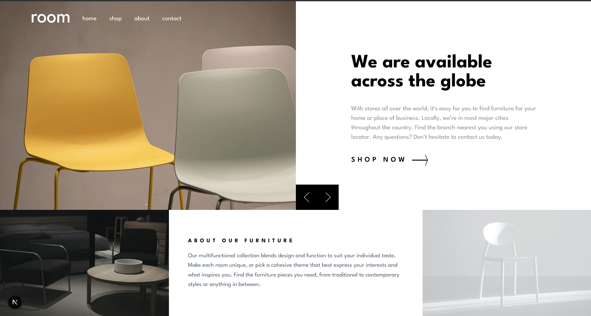

# Frontend Mentor - Room homepage solution

This is a solution to the [Room homepage challenge on Frontend Mentor](https://www.frontendmentor.io/challenges/room-homepage-BtdBY_ENq). Frontend Mentor challenges help you improve your coding skills by building realistic projects. 

## Table of contents

- [Overview](#overview)
  - [The challenge](#the-challenge)
  - [Screenshot](#screenshot)
  - [Links](#links)
- [My process](#my-process)
  - [Built with](#built-with)
  - [What I learned](#what-i-learned)
  - [Continued development](#continued-development)
- [Author](#author)
- [Acknowledgments](#acknowledgments)

## Overview

### The challenge

Users should be able to:
- View an optimal layout for the site depending on their device’s screen size, ensuring a responsive experience across mobile, tablet, and desktop devices.
- See clear hover states for all interactive elements, providing visual feedback when users interact with buttons, links, and controls.
- Navigate the image slider usingmouse/trackpad, allowing for accessible and flexible interaction.

### Screenshot

**Note: Delete this note and the paragraphs above when you add your screenshot. If you prefer not to add a screenshot, feel free to remove this entire section.**

### Links

- Live Site URL: [Add live site URL here](https://your-live-site-url.com)

## My process

### Built with

- Semantic HTML5 markup
- CSS custom properties
- Flexbox
- CSS Grid
- Mobile-first workflow
- [React](https://reactjs.org/) - JS library
- [Next.js](https://nextjs.org/) - React framework

**Note: These are just examples. Delete this note and replace the list above with your own choices**

### What I learned

I get to learn to make a responsive website by using css grid and flex box

### Continued development

Transistion between slides section could be improved and building another pages

## Author

- Frontend Mentor - [@sekarajeng16](https://www.frontendmentor.io/profile/sekarajeng16)
- X - [@SekarYaah](https://www.x.com/SekarYaah)

